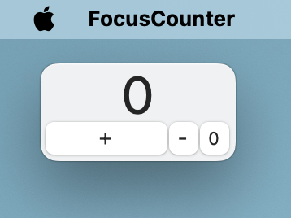

# FocusCounter

A productivity tool inspired by this video by BrendanCescon: https://www.youtube.com/watch?v=q4aQ6BjH174

## What is this

A tally counter that always remain on top of your screen. It helps training your focus and improve productivity by tracking distractions.

When you notice your mind wandering or you become distracted from your work, increment the counter. Use this action as a trigger to refocus on your task.

Think of the counter as representing the “number of times you’ve returned to work” rather than a negative measure of distractions.

## How to use

- Click `+` on screen or press arrow up on keyboard to +1
- Click `-` on screen or press arrow down on keyboard to -1
- Click `0` on screen to reset the counter